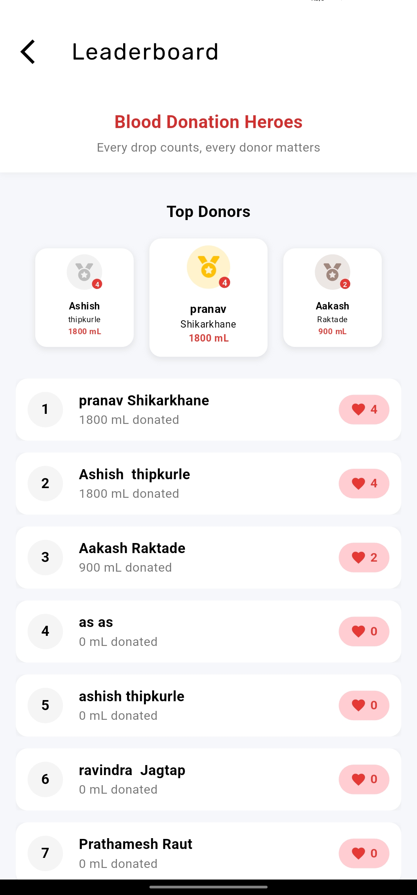

# Rakshak

## Blood Donation Application

Rakshak is a comprehensive blood donation and requesting application built for the residents of Jaysingpur. The app connects blood donors with those in need, provides information about nearby blood banks, and gamifies the donation process through a leaderboard system.

## Features

- **Blood Donation & Request**: Simple process to donate blood or request blood in emergencies
- **Nearby Blood Banks**: Locate blood banks in your vicinity with integrated maps
- **Event Notifications**: Stay updated about upcoming blood donation camps and events
- **Donation Leaderboard**: Recognize frequent donors through a competitive leaderboard
- **User Profiles**: Manage your donation history and personal information

## Technologies Used

- **Frontend**: Flutter (Dart) for cross-platform mobile development
- **Backend**: Supabase for database, authentication, and storage
- **Mapping**: Google Maps integration for location services
- **Storage**: Hive for local storage

## Installation

1. Clone the repository:
   ```bash
   git clone https://github.com/ashishthipkurle/Rakshak.git
   cd Rakshak
   ```

2. Install dependencies:
   ```bash
   flutter pub get
   ```

3. Run the application:
   ```bash
   flutter run
   ```

## Database Setup

### Supabase Configuration

1. Create a Supabase account at [supabase.com](https://supabase.com)
2. Create a new project
3. Set up the following tables:
   For the database tables contect on this email:- ashishthipkurle1@gmail.com

4. Add your Supabase URL and anon key to the project:
   - The URL and anonKey is in the api.dart file.
   - Add the following:
     ```
     SUPABASE_URL=your_supabase_url
     SUPABASE_ANON_KEY=your_supabase_anon_key
     ```

## Google Maps API setup

1. Create a Google Cloud Platform account at [cloud.google.com](https://cloud.google.com)
2. Create a new project
3. Enable the Maps SDK for Android and iOS
4. Generate an API key and restrict it to your app's package name and SHA-1 certificate fingerprint
5. Add the API key to your Flutter project:
   - For Android, add the API key to `android/app/src/main/AndroidManifest.xml`:
     ```xml
     <meta-data
         android:name="com.google.android.geo.API_KEY"
         android:value="YOUR_API_KEY"/>
     ```
   - For iOS, add the API key to `ios/Runner/AppDelegate.swift`:
     ```swift
     GMSServices.provideAPIKey("YOUR_API_KEY")
     ```

## Admin app setup

1. Clone the repository:
   ```bash
   git clone https://github.com/ashishthipkurle/Rakshak_admin.git
   ```

## Usage

### User App
1. Register/Login using your email and password
2. Create a blood request when you need blood
3. View all requests and offer to donate for any matching request
4. Track your donations and requests in the profile section
5. Receive notifications for new offers and updates on your requests
6. Use Google Maps to find nearby blood banks in Blood bank section
7. View donation history and statistics in the profile section
8. View leaderboard to see your ranking among donors
9. View donation camps and events in the events section

### Admin App
1. Manage blood inventory and view stock levels
2. Fulfill urgent blood requests from inventory
3. Track all admin donations from the donation history screen
4. View analytics and statistics for blood donation trends
5. Add donation camps and events for users to see
6. Add donation to the users donation history
7. Add blood bank details to the blood bank section

## Screenshots

| Home Screen                   | User Dashboard                                                                                        |
|-------------------------------|-------------------------------------------------------------------------------------------------------|
|  |  |


### Blood Bank Near User


### Events Near User


### Donation History


### Blood Pressure


### Leaderboard


### Request

## All requests


## User request


## Request 


### Genral information


### User Profile


